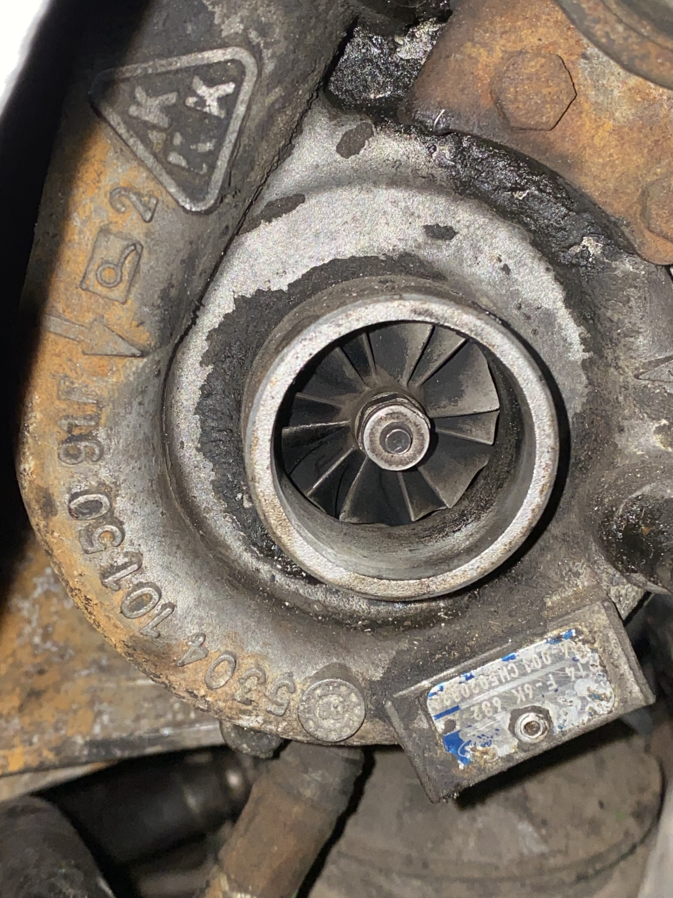

# 01. Спецификация двигателя Ford Transit 4EB

> Точные характеристики двигателя, на котором стоит ТНВД из этого проекта.
> Источник — официальный Ford Workshop Service Manual (Transit 1995, раздел 321).

---

## 1. Идентификация двигателя

| Параметр | Значение |
|---|---|
| Семейство | Ford Transit Mk5 (08/1994 – 07/2000) |
| Тип двигателя | **2.5 TD — турбодизель прямого впрыска (DI)** |
| Заводской код | **`4EB`** для модельного года 1995 |
| Объём | 2496 см³ |
| Цилиндров | 4 рядно |

---

## 2. Геометрия и сжатие

| Параметр | Значение |
|---|---|
| Диаметр × ход поршня | 90,54 × 93,67 мм |
| Степень сжатия | **18,3 : 1** |

---

## 3. Мощностные характеристики

| Параметр | Значение |
|---|---|
| Мощность (EEC) | **74 кВт = 100 л.с.** при 4000 об/мин |
| Крутящий момент (EEC) | **224 Н·м** при 2100 об/мин |
| Холостые обороты | 850 ± 50 об/мин |
| Макс. обороты постоянно | 4000 об/мин |
| Макс. обороты кратковременно | 4400 об/мин |

---

## 4. Топливо и впрыск

| Параметр | Значение |
|---|---|
| Тип впрыска | Прямой (DI) |
| Порядок впрыска | 1-2-4-3 |
| Статический УОВ (опережение впрыска) | **11° до ВМТ** |
| Безопасный диапазон УОВ при тонкой настройке | 8–13° до ВМТ |
| Тип топлива | Дизельное топливо ДТ, цетановое число от 51 |
| ТНВД (по заводу) | Bosch VE распределительный с LDA — `0 460 414 173` или `0 460 414 174` (Mk5 4EB). Подробно — в [`02-совместимость-тнвд.md`](./02-совместимость-тнвд.md) |

---

## 5. Турбонаддув и впуск

> 📷 Маркировка моей турбины (фото с машины) — `T4 F-6K 682`, `5304 10130 91F`, `4-901 CH50-200X`. Логотип `KKK` отлит прямо на корпусе — это **точно KKK K04** (BorgWarner), серия `5304 ...`.
>
> 

| Параметр | Значение |
|---|---|
| **Турбонаддув** | **Есть** |
| Производитель турбины | **KKK (BorgWarner)** |
| Модель турбины | **K04** (`53049700001` или `53049880001`) |
| Ford OEM | `914F-6K682` (варианты `AB`, `AC`, `AD`, `AF`, `AG`) |
| Типичное давление наддува | ~0,7–0,9 бар на полной нагрузке |
| **Интеркулер** | **НЕТ в этой комплектации** ⚠️ |

> ⚠️ **Отсутствие интеркулера — ключевой фактор**, к которому возвращаемся в каждом разделе про детонацию. Без интеркулера наддувочный воздух поступает в цилиндры **горячим (~80–100 °C)**. Чем горячее воздух — тем сильнее склонность к детонации. Это **усиливает** проблему «жирной» калибровки ТНВД.

---

## 6. Что нужно знать про этот двигатель в контексте ТНВД

- 4EB — **турбо**, поэтому ТНВД должен быть **турбо-исполнения**, то есть с LDA-корректором. ✅ Наш `0460414159` — турбо.
- 4EB — **прямой впрыск (DI)**, поэтому профиль кулачка плунжера должен быть «DI-шный». ✅ Наш `0460414159` — DI.
- 4EB штатно настроен под относительно **холодную камеру сгорания** (рассчитан на работу без интеркулера, т.е. при чуть «съеденной» плотности воздуха) — поэтому ТНВД должен быть откалиброван по плану `R686` / `R711` / `R624`. ❌ Наш насос — `R509-4` (это план Land Rover 300Tdi с интеркулером), и это даёт детонацию. Подробно — в [`docs/Проблемы/01-детонация.md`](../Проблемы/01-детонация.md).

---

## 7. Сравнение с родственниками 2.5 TD/TDI Transit

| Код | Применение | Мощность | Интеркулер | Турбо | Заводской ТНВД |
|---|---|---|---|---|---|
| **`4EB`** (наш) | Mk5 1994–2000, 100 PS | 74 кВт | **Нет** | KKK K04 | `0460414173` / `0460414174` |
| `4EC` | Mk5 1994–2000, 100 PS, поздние | 74 кВт | Нет | KKK K04 | `0460414173` / `0460414174` |
| `4EA` | Mk4 1991–1994, 100 PS | 74 кВт | Нет | KKK K04 | `0460414154` / `0460414155` |
| `4HCX` | Mk5, 76 PS | 56 кВт | Нет | Нет (атмо) | `0460414145` / `0460414146` / `0460414141` |
| `4HB` | Mk4/5, 76 PS | 56 кВт | Нет | Нет (атмо) | `0460414145` и аналоги |

> 💡 Это полезно знать при поиске б/у замены ТНВД (на разборках часто бывают «насосы от похожего двигателя» — далеко не все взаимозаменяемы).

---

## 8. Источники подтверждения характеристик

- Ford Workshop Service Manual, Transit 1995, раздел 321 «Basic Engine».
- Pro Ford SPB — русскоязычная компиляция спецификаций 4EB.
- LDV 2.5 DI Service Manual — родственный двигатель (тот же York 2.5).
- Транзит-каталоги turbo по `914F-6K682AF` — подтверждение KKK K04.

Полные ссылки — в [`docs/Источники/01-ссылки.md`](../Источники/01-ссылки.md), раздел «Двигатель Ford Transit 4EB».
