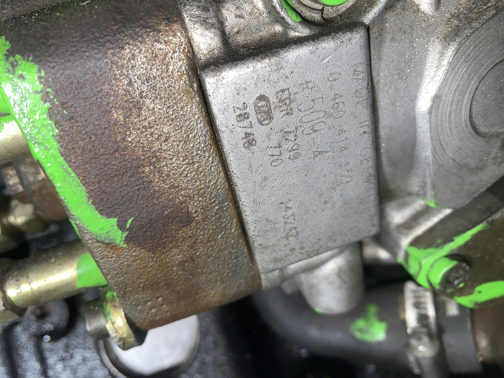

# 02. Маркировка и идентификация ТНВД

> Что выбито на табличке моего конкретного экземпляра ТНВД и как это расшифровывается.
> Голые технические параметры — в [`01-спецификация.md`](./01-спецификация.md).

---

## 1. Что реально выбито на табличке (фото с моей машины)



| Поле | Значение | Что это значит |
|---|---|---|
| Артикул Bosch | **`0 460 414 159`** | Заводской каталожный номер ТНВД |
| Калибровочный код | **`R 509-4`** | Тестовый план Bosch — по нему ТНВД настраивается на стенде. Уникален для конкретной модели/мощности двигателя |
| OEM-номер | **`ERR 7299`** | Land Rover OEM. **`ERR 7299`** соответствует **военной (Wolf) версии** ТНВД для Land Rover Defender 300Tdi. Гражданский эквивалент — `ERR 4419` (по подтверждению Bosch service agent, корпуса и настройки идентичны) |
| Внутренний код | **`770 143242`** | Код даты выпуска / партии Bosch (внутренняя информация Bosch) |
| Серийный № | **`28748`** | Серийный номер конкретного экземпляра |
| Доп. маркировка на корпусе | **`bosh 730769162`** (с орфографической ошибкой «bosh» вместо «Bosch») | **НЕ оригинальный Bosch.** Скорее всего номер ремонтника/восстановителя — насос проходил через дизельный сервис |

> ⚠️ Маркировка `bosh 730769162` (с орфографической ошибкой) — почти 100 % признак того, что насос **уже был на стенде у дизельщика**. Это важно для понимания, почему он сейчас может быть откалиброван не строго по плану `R509-4`, а под «что-то промежуточное».

> 📷 Видна также зелёная краска на корпусе (на фото боковой грани — [`assets/фото/тнвд-боковая-маркировка.jpg`](../../assets/фото/тнвд-боковая-маркировка.jpg)) — это типовая маркировка дизельного сервиса после регулировки на стенде.

---

## 2. Расшифровка тип-кода

Полный тип-код этого ТНВД — **`VE4/11F2000R509-4`**. Подтверждение источников: каталог `autodiesel13.com`, выписка `Bosch_VE_pumps.pdf`, надпись `R 509-4` на самой табличке.

```
  V E    4    /    11    F     2000      R       509     -    4
  │ │    │         │     │      │        │         │          │
  │ │    │         │     │      │        │         │          └── ревизия исполнения тестового плана
  │ │    │         │     │      │        │         └─────────── номер тестового плана Bosch
  │ │    │         │     │      │        │                       (R509 = семейство Land Rover 300Tdi)
  │ │    │         │     │      │        └─────────────────── направление вращения
  │ │    │         │     │      │                              R = по часовой (со стороны привода)
  │ │    │         │     │      │                              L = против часовой
  │ │    │         │     │      └────────────────────────── частота вращения вала ТНВД (об/мин),
  │ │    │         │     │                                   на которую настроен регулятор
  │ │    │         │     │                                   ⇒ 2000 об/мин ТНВД = 4000 об/мин
  │ │    │         │     │                                     двигателя (передача 1:2)
  │ │    │         │     └─────────────────────────────── F = механический центробежный регулятор
  │ │    │         │                                       (Fliehkraftregler по Bosch-номенклатуре)
  │ │    │         └────────────────────────────────── диаметр плунжера в мм
  │ │    └─────────────────────────────────────────── число цилиндров
  │ └─────────────────────────────────────────────── E = распределительный (Verteiler)
  └────────────────────────────────────────────────── V = тип насоса (Verteiler)
```

---

## 3. Соответствие тест-плана `R509-4` и применения

| Bosch test plan | Применение | OEM-номер Land Rover |
|---|---|---|
| `VER509` (`R509-1`, `R509-2`, …, `R509-4`) | **Land Rover 300Tdi** (Defender, Discovery 1, Range Rover Classic 1992–1998) | `ERR 4419` (civilian) / `ERR 7299` (military Wolf) |
| `VER347` | Land Rover 200Tdi | `ERR 0459`, `ERR 1333` и др. |
| `R686` / `R711` / `R624` | Ford Transit Mk5 (4EB / 4EC) | — (Ford OEM) |

Подтверждение принадлежности `R509` к 300Tdi:

- Bob Beck Fuel Injection (UK): прямо называет 0460414159 как «Discovery 300Tdi DIESEL FUEL INJECTION PUMP».
- Mick Ogden Diesels (UK), список Bosch test plans: `0460414098 → ERR4419 → VER509 → 300Tdi`.
- LandyZone форум (опытный владелец Wolf Defender): «Part number for the Wolf injector Pump is `ERR 7299` (as stamped on the pump casing) and yet the civilian version is `ERR4419`. The 7299 is a later model… the housings are identical… fuel settings are also identical».

Ссылки на источники — в [`docs/Источники/01-ссылки.md`](../Источники/01-ссылки.md).

---

## 4. Что это значит для эксплуатации

ТНВД 0 460 414 159 с тест-планом `R509-4` (= Land Rover 300Tdi, военная версия Wolf) **установлен на двигатель Ford Transit 4EB без интеркулера**. Совместимость есть по 6 из 7 параметров; седьмой — калибровка — даёт детонацию под нагрузкой.

Подробное объяснение причины и как лечить — в [`docs/Проблемы/01-детонация.md`](../Проблемы/01-детонация.md).
Сравнение «штатный для 4EB ↔ установленный донор» — в [`docs/Двигатель/02-совместимость-тнвд.md`](../Двигатель/02-совместимость-тнвд.md).
