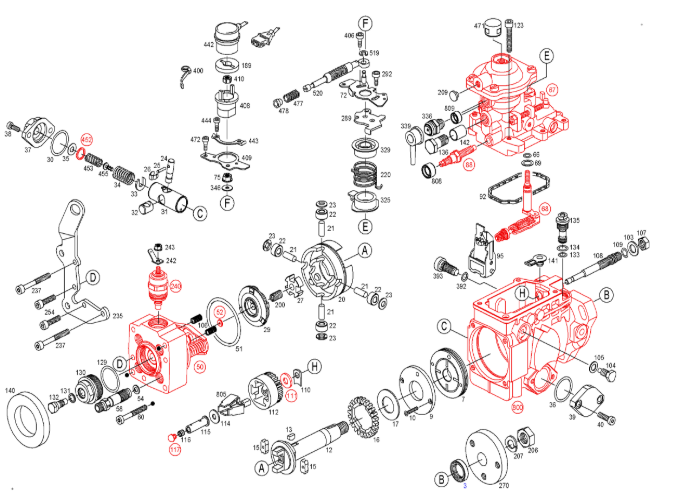

# 03. Номера запчастей ТНВД 0 460 414 159

> Чистая справочная таблица: номер позиции на схеме ↔ артикул Bosch ↔ название.
> Без описаний, без советов, без рисков. Это «справочник для заказа».
> Описание ключевых узлов с пояснениями — в [`04-ключевые-узлы.md`](./04-ключевые-узлы.md).
> Готовые ремкомплекты и сценарии «профилактика / переборка» — в [`05-ремкомплекты.md`](./05-ремкомплекты.md).
> Источник данных — официальный каталог [`dieselcatalog.online`](https://dieselcatalog.online/ru/bosch/0460/0460414159.html), сохранённая копия (`.mhtml`) лежит в корне проекта.

---

## 1. Схема ТНВД

> Каждая деталь на схеме имеет номер позиции (от 3 до 813). По этому номеру в таблице ниже находится конкретный артикул Bosch.

---

## 2. Полный список запчастей (по возрастанию номера позиции)

> 🔥 — критичные узлы (на что в первую очередь смотреть при проблемах). Пояснения по этим узлам — в [`04-ключевые-узлы.md`](./04-ключевые-узлы.md).
> ⚙️ — регулировочный элемент.

| Поз. | Артикул Bosch | Наименование | Кол-во |
|---|---|---|---|
| 3 | `2 460 283 001` | Сальник вала привода | 1 |
| 7 | `1 467 030 308` | 🔥 **Подкачивающий насос (роторный)** | 1 |
| 9 | `1 460 134 317` | Шайба опорная / опорное кольцо | 1 |
| 10 | `1 463 429 300` | Винт с потайной головкой Torx | 2 |
| 12 | `1 466 100 405` | **Приводной вал** | 1 |
| 13 | `1 460 023 302` | Регулировочная пружина | 1 |
| 15 | `1 460 056 302` | Буфер / амортизатор | 2 |
| 16 | `1 466 317 301` | Зубчатое колесо привода регулятора | 1 |
| 17 | `2 460 102 001` | Шайба скольжения | 1 |
| 20 | `1 460 232 328` | Роликовое кольцо / шайба роликовая | 1 |
| 21 | `2 463 100 002` | Ролик / болт крышки подшипника | 4 |
| 22 | `2 460 300 005` | Направляющий ролик | 4 |
| 23 | `2 460 120 013` | Пусковая шайба | 4 |
| 24 | `1 463 103 316` | Регулировочный болт | 1 |
| 25 | `1 463 120 359` | Поддерживающий болт | 1 |
| 26 | `1 461 310 300` | Поручень / хомут | 1 |
| 27 | `1 460 140 334` | Крестообразная шайба | 1 |
| 29 | `1 466 110 647` | 🔥 **Кулачковая шайба (торцевой кулачок)** | 1 |
| 30 | `2 460 223 001` | Сальник / уплотнительное кольцо | 1 |
| 31 | `1 463 104 498` | **Поршень муфты опережения впрыска** | 1 |
| 32 | `1 463 218 312` | Скользящая деталь | 1 |
| 33 | `1 460 144 302` | Шайба опорная / распорная | 1 |
| 34 | `1 464 618 934` | Пружина сжатия | 1 |
| 35 | `1 460 100 178` | Подкладочная шайба | 1 |
| 36 | `2 460 223 001` | Сальник / уплотнительное кольцо | 1 |
| 37 | `1 465 530 901` | Предохранительная крышка | 1 |
| 38 | `1 463 414 344` | Болт с цилиндрической головкой Torx | 2 |
| 39 | `1 461 074 330` | Защитная пластина | 1 |
| 40 | `2 463 414 001` | Болт с цилиндрической головкой Torx | 2 |
| 50 | `1 468 334 851` | 🔥 **ПЛУНЖЕРНАЯ ПАРА / ГИДРОГОЛОВКА (сердце ТНВД)** | 1 |
| 51 | `2 460 210 012` | Кольцо уплотнительное (О-ring) | 1 |
| 52 | (группа выбора) | Балансировочная шайба | 1 |
| 54 | `1 460 105 305` | Уплотнительная шайба под нагнетательный штуцер | 4 |
| 58 | (без номера) | Присоединительный штырь (нагнетательный штуцер) | 4 |
| 60 | `1 463 414 312` | Болт с цилиндрической головкой Torx | 2 |
| 66 | `1 460 210 008` | Кольцо уплотнительное (О-ring) | 1 |
| **67** | **`1 467 134 399`** | 🔥 **LDA-КОРРЕКТОР (пневматический регулятор по давлению наддува)** | 1 |
| **68** | **`1 463 163 150`** | **Регулятор частичных нагрузок** | 1 |
| 69 | `1 200 101 640` | Шайба | 1 |
| 72 | `1 461 901 816` | Рычаг регулятора / газа (тросовая тяга) | 1 |
| 75 | `1 463 315 310` | Гайка с буртиком | 1 |
| **88** | (под пломбой) | ⚙️ 🔧 **РЕГУЛИРОВОЧНЫЙ ВИНТ МАКСИМАЛЬНОЙ ПОДАЧИ** | 1 |
| 92 | `1 461 015 302` | Уплотнительная шайба | 1 |
| 95 | `1 461 907 159` | Рычаг регулятора | 1 |
| 103 | `2 916 012 017` | Подкладочная шайба DIN 433 | 1 |
| 104 | `1 463 452 313` | Резьба цапфы | 2 |
| 105 | `1 460 105 307` | Уплотнительная шайба | 2 |
| 106 | `1 464 613 611` | Пружина сжатия | 2 |
| 107 | `1 463 300 304` | Гайка шестигранная | 1 |
| 108 | `1 463 590 311` | Ось регулятора (для центробежных грузиков) | 1 |
| 109 | `1 460 210 313` | Кольцо уплотнительное (О-ring) | 1 |
| 110 | `1 461 030 343` | Компенсационная пластина 0,95 мм | 1 |
| 111 | (группа выбора) | Опорный диск | 1 |
| 112 | `1 466 317 319` | **Обойма для центробежных грузиков** | 1 |
| 114 | `1 460 100 370` | Шайба опорная / распорная | 1 |
| 115 | `1 460 422 324` | **Муфта (втулка) регулятора — задаёт цикловую подачу** | 1 |
| 116 | `1 460 508 309` | Пломба / уплотнительный колпак | 1 |
| 117 | `1 463 203 907` | Группа выбора пробки / предохранительный диск | 1 |
| 123 | `2 910 142 207` | Винт с внутренним шестигранником M6×35 | 4 |
| 129 | `1 460 210 349` | Кольцо уплотнительное (О-ring) | 1 |
| 130 | `1 463 461 306` | Болт / резьбовая пробка | 1 |
| 131 | `1 460 105 306` | Шайба уплотнительная плоская | 1 |
| 132 | `1 463 453 306` | Болт пустотелый / винт вентиляции | 1 |
| 133 | `1 460 225 081` | Кольцо уплотнительное (О-ring) | 1 |
| 134 | `1 460 225 082` | Кольцо уплотнительное (О-ring) | 1 |
| 135 | `1 460 362 468` | **Регулирующий клапан давления подкачки** | 1 |
| 136 | `1 463 456 344` | Пустотелый болт | 1 |
| 140 | `1 460 591 315` | Защитный колпак | 1 |
| 141 | `2 410 508 006` | Защитный колпак | 1 |
| 142 | `1 410 407 004` | Защитная втулка | 1 |
| 189 | `1 460 101 376` | Уплотнительная шайба | 1 |
| 200 | `2 464 633 002` | Пружина сжатия | 1 |
| 206 | `2 915 021 004` | Гайка шестигранная DIN 934 M14×1.5 | 1 |
| 207 | `2 916 699 137` | Пружинная стопорная шайба DIN 128 A14 | 1 |
| 209 | `1 900 508 202` | Защитный колпак | 1 |
| 220 | `1 464 651 461` | Витая изгибная пружина | 1 |
| 235 | `1 461 021 714` | Пластина опорная / опорная плита | 1 |
| 237 | `1 463 414 305` | Болт с цилиндрической головкой Torx | 2 |
| **240** | **`0 330 001 046`** | 🔥 **ЭЛЕКТРОМАГНИТ ОТСЕЧКИ ТОПЛИВА (12 В)** | 1 |
| 242 | `1 464 477 302` | Плоский штекер | 1 |
| 243 | `1 463 314 306` | Гайка с буртиком | 1 |
| 254 | `2 910 142 203` | Винт с внутренним шестигранником M6×25 | 2 |
| 270 | `1 466 434 322` | **Полумуфта на валу привода** | 1 |
| 289 | `1 461 900 628` | Рычаг управления / установочный | 1 |
| 289 | `1 461 900 627` | Рычаг управления / установочный (вариант) | 1 |
| 292 | `1 463 433 313` | Комбинированный винт | 1 |
| 325 | `1 460 522 328` | Тарелка пружины | 1 |
| 329 | `1 460 522 304` | Тарелка пружины | 1 |
| 336 | `1 463 386 301` | Вентиляционный штуцер | 1 |
| 339 | `1 460 558 303` | Защитный колпак | 1 |
| 346 | `1 460 100 893` | Подкладочная шайба | 1 |
| 392 | `1 460 210 322` | Кольцо уплотнительное (О-ring) | 1 |
| 393 | `1 463 462 308` | Болт / резьбовая пробка | 1 |
| 400 | `1 464 736 300` | Натяжная лента | 1 |
| 406 | `1 463 433 313` | Комбинированный винт | 1 |
| 408 | `1 460 326 387` | Ведомый диск / втулка / захват | 1 |
| 409 | `1 461 098 346` | Пластина крепления | 1 |
| 410 | `1 463 300 319` | Гайка шестигранная | 1 |
| **442** | **`1 467 217 359`** | 🔥 **ПОТЕНЦИОМЕТР (датчик положения рычага газа)** | 1 |
| 443 | `1 461 098 344` | Пластина крепления | 1 |
| 444 | `1 463 433 320` | Комбинированный винт | 2 |
| 452 | (группа выбора) | Балансировочная шайба | 3 |
| 453 | `1 464 616 956` | Пружина сжатия | 1 |
| 455 | `1 463 219 304` | Клапан муфты / заслонка регулятора | 1 |
| 471 | `1 460 505 308` | Защитный колпак | 1 |
| 472 | `2 912 702 197` | Винт с цилиндрической головкой | 2 |
| 477 | `1 464 610 988` | Пружина сжатия | 1 |
| 478 | `1 460 421 302` | Направляющая гильза / втулка | 1 |
| 519 | `2 916 089 956` | Стопорная шайба DIN 6799 3.2 | 1 |
| 520 | `1 463 022 310` | Направляющий стержень | 1 |
| 800 | `1 465 130 704` | 🔥 **КОРПУС ТНВД (группа запчастей)** | 1 |
| 805 | `1 467 010 054` | **Ремкомплект центробежных грузиков** | 1 |
| 808 | `1 460 591 313` | Пломба / уплотнительный колпак красный | 1 |
| 809 | `2 420 580 005` | Пломба / уплотнительный колпак красный | 1 |

---

## 3. Отдельно — самые ходовые расходники

| Назначение | Артикул Bosch | Где |
|---|---|---|
| Сальник приводного вала (под вал 20 мм, размер 31×20×7) | `2 460 283 001` | Поз. 3 |
| Мембрана LDA-корректора (одна деталь, не ремкомплект) | `1 460 503 304` | Поз. 67 (внутри) |
| Уплотнительная шайба под нагнетательный штуцер | `1 460 105 305` | Поз. 54 (4 шт.) |
| Главный ремкомплект уплотнений турбо-VE | `1 467 010 467` | Не позиция, а готовый набор — [`05-ремкомплекты.md`](./05-ремкомплекты.md) |

---

## 4. Что НЕ попало в этот каталог Bosch

- **Трубки высокого давления** (от ТНВД к форсункам) — это деталь **двигателя**, а не насоса. См. [`06-трубки-высокого-давления.md`](./06-трубки-высокого-давления.md).
- **Топливные шланги низкого давления** (от бака к фильтру, от фильтра к ТНВД) — это деталь автомобиля, не ТНВД.
- **Прокладка между ТНВД и плитой двигателя** — она входит **только** в «-S»-версию ремкомплекта (`1 467 010 467-S`), см. [`05-ремкомплекты.md`](./05-ремкомплекты.md).
